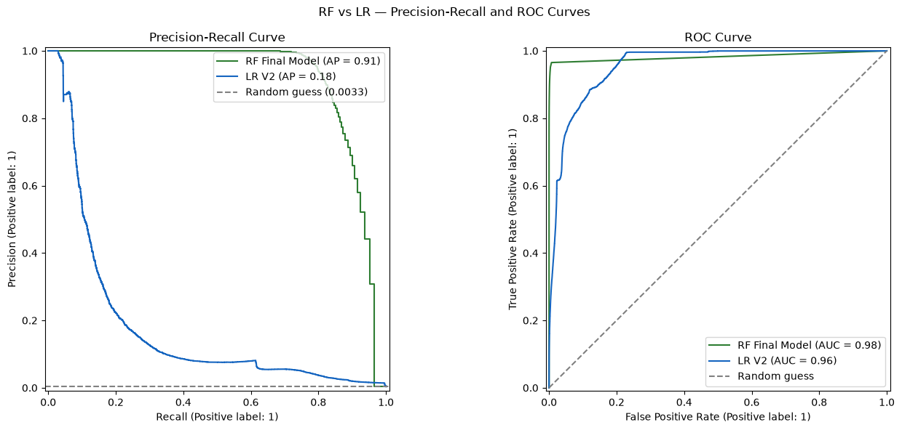

# PaySim Transactions Fraud Detection


End-to-end machine learning pipeline for detecting fraudulent transactions.

---

## Overview

Most fraud models stop at flagging suspicious transactions — but a flag is only as useful as it is trustworthy. At the start, this project set out to build a fraud classifier that could deal with the class imbalance, and answer if fraud clustered in different transaction types, but the most important work turned out to be figuring out which of its own results to believe. The baseline Random Forest I constructed scored a suspicious 1.0 across every metric, and investigation traced this to engineered features that near-perfectly encoded PaySim's synthetic fraud-generation rule rather than real fraud signal. After removing the leakage, the final model — Random Forest, tuned via `RandomizedSearchCV` — achieved **recall 0.77 and precision 0.98** overall, but segmentation by transaction type told a more useful story: **`CASH_OUT` (recall 0.55, precision 0.93)** is the deployment-trustworthy segment, while `TRANSFER`'s perfect 1.0 score is treated as a red flag, not a win, since it likely reflects the same synthetic artifact resurfacing rather than genuine reliability. Beyond dealing with imbalance, the simulated dataset presented an unexpected challenge of accidentally engineering the same features used by the simulation to classify fraud cases. 

For this project I came up with two research questions — why `TRANSFER` is riskier than `CASH_OUT`, and whether fraud follows a `TRANSFER` -> `CASH_OUT` money-laundering behavior chain. My EDA revealed that these questions turned out to be unanswerable from this dataset: no such chain exists in the data, and no feature explains the risk gap. That absence is itself a finding about the limits of synthetic data for modeling real fraud behavior.

---
## The Problem

Fraud detection is hard not only because fraud is rare (~0.13% of transactions here), but also because that rarity makes it easy to build a model that looks excellent when it is actually broken — a classifier can hit near-perfect scores by learning shortcuts in how the data was generated rather than real fraud patterns, and severe imbalance means standard accuracy checks won't catch this. This project treats that risk as the central problem: not just building a classification model, but verifying that the model's performance reflects genuine signal rather than an artifact of PaySim's synthetic generation rules — and being explicit about what a simulated dataset can and can't tell about real-world fraud.

---

## Dataset

**Source:** [PAYSIM](https://www.kaggle.com/datasets/moonknightmarvel/paysim) from Kaggle — **Size:** 6,362,620 transaction events, 11 features covering transaction types, account balances, and fraud signal. The target variable `isFraud` is heavily imbalanced: ~0.13% fraud, ~99.87% legit — making recall the primary evaluation metric over accuracy.

---

## Key Results

| Model | Fraud Precision | Fraud Recall | PR-AUC |
|---|---|---|---|
| LR Baseline | 0.07 | 0.9 | 0.624 |
| LR V2 | 0.01 | 0.98 | 0.179 |
| RF Baseline (leaky) | 1.0 | 1.0 | 1.0 |
| RF 3.5.1 (partial fix) | 0.97 | 0.83 | 0.975 |
| **RF Final (V2)** | **0.98** | **0.77** | **0.913** |

**Recommended model:** Random Forest (V2) — Fraud recall 0.77, PR-AUC 0.913. Recall prioritized over accuracy due to class imbalance (~0.13% fraud) — missing a fraudulent transaction is more costly than a false alarm.

---

## RF vs. LR — Precision-Recall and ROC Curves Comparison Visualization



---

## Project Structure

```
fraud-detection/
├── data/
│   ├── raw/
│   └── processed/
├── images/
├── notebooks/
│   ├── 01_eda.ipynb
│   ├── 02_feature_engineering.ipynb
│   └── 03_modeling_and_evaluation.ipynb
├── .gitignore
├── README.md
└── requirements.txt
```

---

## Approach

### 1. EDA
Identified severe class imbalance (~99.87% legit vs. ~0.13% fraud). Initial question — whether fraud differed by transaction type — led to finding fraud concentrated in only 2 of 5 types (`TRANSFER`, `CASH_OUT`), with `TRANSFER` having a higher fraud rate (0.77% vs. 0.18%). Reframed research around two questions:
- **Q1**: Why is `TRANSFER` riskier than `CASH_OUT`?
- **Q2**: Is there a `TRANSFER` -> `CASH_OUT` behavioral chain?

Key patterns found:
- `oldbalanceOrg`–`amount` correlation of 0.86 in fraud cases specifically
- `newbalanceOrig` clusters near zero in fraud — consistent with account draining
- `step` expected to be a weak predictor (reflects simulation time, not behavior)

### 2. Feature Engineering
- `amount_to_oldbalanceOrg_ratio` and `balance_drained_ratio` — engineered to make the amount/balance relationship and draining pattern explicit (later found to leak in modeling)
- `amount` log-transformed (`log1p`) for skew
- `type` one-hot encoded
- Dropped `nameOrig`, `nameDest`, `isFlaggedFraud` — no signal, high cardinality, or constant
- Split on `step` to prevent temporal leakage; `step` itself dropped from features afterward

### 3. Modeling
Baseline Random Forest scored a suspicious 1.0/1.0 — investigated via feature importances and traced to `amount_to_oldbalanceOrg_ratio` and `balance_drained_ratio`, both near-deterministic encodings of PaySim's synthetic fraud-generation rule. Dropped both, retrained, and still saw the same leakage signature — feature importances traced it to `newbalanceOrig` (at least 75% zero in fraud rows, a synthetic artifact). Dropped `newbalanceOrig`; kept `oldbalanceOrg`, whose fraud distribution is shifted but continuous (median ~$439K fraud vs. ~$14K legit) — consistent with real targeting behavior rather than an artifact. Full metrics for each stage are in Key Results below.

Also trained Logistic Regression on the same leak-free features for comparison: precision collapsed to 0.01. This was caused by three compounding things: `class_weight='balanced'`, loss of the strongest deterministic features once leakage was removed, and LR's single linear decision boundary forcing a wide net to catch fraud. Moved forward with Random Forest.

### 4. Tuning
Used `RandomizedSearchCV` on stratified subsamples (F-beta ~= 0.73) found sklearn's defaults (`n_estimators=100`, `min_samples_leaf=1`, `max_depth=None`) were already optimal — no retrain needed.

### 5. Segmentation Analysis
Evaluated the final model separately on `TRANSFER` and `CASH_OUT` (the only fraud-bearing types). `TRANSFER` scored a perfect 1.0 across all metrics; `CASH_OUT` recall dropped to 0.55. Limitations explains why the perfect `TRANSFER` score is treated as a red flag rather than a strength.

---

## Limitations 

**Limitations:**
-  `Recall` ceiling (~0.77): roughly 23% of fraud cases are missed overall, and this gap is worse for `CASH_OUT` transactions specifically (`recall` 0.55). Recovering `recall` further likely requires new engineered features (e.g., transaction size relative to an account's own history) rather than further hyperparameter tuning, since tuning already confirmed sklearn's defaults are near-optimal for this feature set.

- Feature redundancy: `amount` and `amount_log` are correlated (log-transform of the same value); their combined importance (~0.27) likely overstates one underlying signal split across two features. Not corrected in this version.

- Residual leakage risk on `TRANSFER`: the model scores perfectly (1.0 `precision`/`recall`/`PR-AUC`) on `TRANSFER` transactions, which is suspicious given this dataset's history of synthetic leakage. This likely reflects RF reconstructing the "drain the account" pattern via an `amount`/`oldbalanceOrg` interaction, even without the explicit ratio feature — suggesting this artifact may be structurally embedded in PaySim's fraud generation and not fully removable without dropping features that are otherwise legitimate and necessary.

- Synthetic dataset: PaySim is simulated data with known generation rules; real-world fraud patterns may not follow the same "drain to zero" logic, so performance here — especially the `TRANSFER` results — may not generalize to production data.

---

## Next Steps

- Engineer non-deterministic behavioral features (e.g., transaction-size-relative-to-account-history) to recover `recall` without reintroducing leakage
- Validate whether the `TRANSFER` anomaly persists after dropping `oldbalanceOrg` or `amount` individually, time permitting.
- Resolve `amount`/`amount_log` redundancy by dropping one and retraining, to get a cleaner feature importance ranking. 

---

## Reproduction Instructions

1. Clone the repo and install dependencies:
```bash
git clone https://github.com/joshuasim/fraud-detection
cd fraud-detection
pip install -r requirements.txt
```
2. Create the data folders: 
   ```bash
   mkdir -p data/raw data/processed
   ```
3. Download the dataset from [Kaggle](https://www.kaggle.com/datasets/moonknightmarvel/paysim) and place `paysim.csv` in `data/raw/`

4. Run notebooks in order:
   - `notebooks/01_eda.ipynb`
   - `notebooks/02_feature_engineering.ipynb`
   - `notebooks/03_modeling_and_evaluation.ipynb`

--- 

## Technologies Used

Python, pandas, numpy, matplotlib, seaborn, scikit-learn